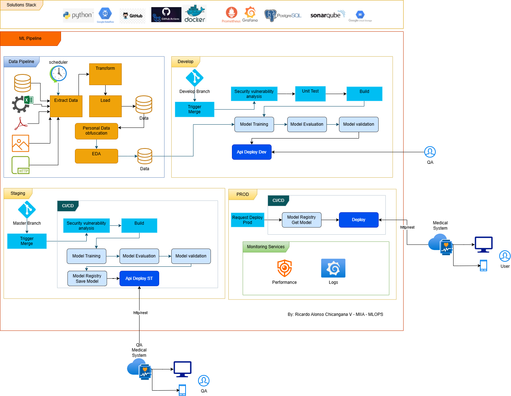

# Changelog

## Versión 2.0.0 - 2025-11-23

Esta versión implementa un sistema completo de despliegue automático (CI/CD) con integración de modelos ONNX, pipelines automatizados con GitHub Actions, y almacenamiento en AWS S3.

### ✨ Nuevas Características

* **Sistema de Despliegue Automático CI/CD:**
    * Pipeline completo de GitHub Actions para ramas `develop` y `prod`
    * Despliegue automático a AWS ECS/ECR en cada push
    * Separación de ambientes (desarrollo y producción) con endpoints independientes

* **Integración con Modelo ONNX:**
    * API Flask adaptada para usar modelos ONNX en lugar de reglas hardcodeadas
    * Descarga automática del modelo desde AWS S3
    * Preprocesamiento de datos categóricos a formato numérico para el modelo
    * Inferencia en tiempo real usando `onnxruntime`

* **Almacenamiento en AWS S3:**
    * Modelo ONNX almacenado en S3 (no versionado en Git)
    * Datos de prueba descargados desde S3 durante tests
    * Guardado automático de predicciones en archivos TXT separados por ambiente
    * Archivos de predicciones: `predicciones_dev.txt` y `predicciones_prod.txt`

* **Tests Mejorados:**
    * Tests que descargan datos de prueba desde S3
    * Validación de respuesta del modelo con diferentes inputs
    * Validación de métricas con umbrales de calidad
    * Tests ejecutados automáticamente en cada push

* **Scripts de Utilidad:**
    * `model/upload_model_to_s3.py`: Script para subir modelos ONNX a S3
    * `model/create_onnx_model.py`: Script para generar modelo ONNX
    * `Api/scripts/create_test_data.py`: Script para crear y subir datos de prueba a S3

* **Documentación Completa:**
    * `DEPLOYMENT.md`: Guía completa de despliegue y configuración
    * `IMPLEMENTACION.md`: Resumen detallado de la implementación
    * `EXPLICACION_PASO_A_PASO.md`: Explicación educativa de cada componente
    * `env.example`: Ejemplo de configuración de variables de entorno

### 🔄 Modificaciones en Archivos Existentes

* **`Api/app.py`:**
    * Reemplazada función de clasificación hardcodeada por inferencia con modelo ONNX
    * Agregada descarga de modelo desde S3
    * Agregado guardado de predicciones en S3
    * Agregado preprocesamiento de datos para el modelo
    * Agregado endpoint `/health` para health checks
    * Soporte para variables de entorno para configuración flexible

* **`Api/test_app.py`:**
    * Tests actualizados para descargar datos desde S3
    * Agregado test de respuesta del modelo con inputs definidos
    * Agregado test de validación de métricas con umbrales
    * Integración con boto3 para acceso a S3

* **`Api/Dockerfile`:**
    * Actualizado con dependencias para ONNX (`onnxruntime`)
    * Agregado soporte para AWS (`boto3`)
    * Agregadas dependencias de sistema necesarias
    * Optimizado para descargar modelo en tiempo de ejecución

* **`Api/requirements.txt`:**
    * Agregado `onnxruntime>=1.16.0` para ejecución de modelos ONNX
    * Agregado `boto3>=1.28.0` para interacción con AWS S3
    * Agregado `python-dotenv>=1.0.0` para manejo de variables de entorno
    * Agregado `numpy>=1.24.0` para procesamiento numérico
    * Agregado `pandas>=2.0.0` para manejo de datos de prueba

### 🆕 Archivos Nuevos

* **`.github/workflows/dev-pipeline.yml`:**
    * Pipeline de CI/CD para rama `develop`
    * Etapa de test con descarga de modelo y datos desde S3
    * Etapa de build y deploy a AWS ECS (ambiente desarrollo)

* **`.github/workflows/prod-pipeline.yml`:**
    * Pipeline de CI/CD para rama `prod`
    * Etapa de test con descarga de modelo y datos desde S3
    * Etapa de build y deploy a AWS ECS (ambiente producción)

* **`model/create_onnx_model.py`:**
    * Script para generar modelo ONNX que replica la lógica hardcodeada
    * Entrena árbol de decisión y convierte a formato ONNX

* **`model/upload_model_to_s3.py`:**
    * Script para subir modelos ONNX a S3
    * Utiliza variables de entorno para configuración

* **`model/README.md`:**
    * Documentación completa sobre generación y uso del modelo

* **`Api/scripts/create_test_data.py`:**
    * Script para crear y subir datos de prueba a S3
    * Genera CSV con casos de prueba

* **`Api/scripts/__init__.py`:**
    * Inicialización del paquete scripts

* **`Api/env.example`:**
    * Ejemplo de configuración de variables de entorno
    * Incluye configuración de AWS, S3, y ambientes

* **`DEPLOYMENT.md`:**
    * Documentación completa del sistema de despliegue
    * Guía de configuración paso a paso
    * Instrucciones para AWS, GitHub Secrets, y despliegue

* **`IMPLEMENTACION.md`:**
    * Resumen de todos los requisitos cumplidos
    * Estructura de archivos y su propósito
    * Flujo de trabajo completo

* **`EXPLICACION_PASO_A_PASO.md`:**
    * Explicación educativa detallada de cada componente
    * Conceptos fundamentales de CI/CD, ONNX, Docker
    * Flujos completos con ejemplos

### 🔧 Cambios Técnicos

* **Arquitectura:**
    * Migración de clasificación basada en reglas a modelo ML (ONNX)
    * Integración con servicios de AWS (S3, ECR, ECS)
    * Separación clara entre ambientes de desarrollo y producción

* **CI/CD:**
    * Automatización completa del proceso de despliegue
    * Tests automáticos en cada push
    * Despliegue condicional (solo si tests pasan)
    * Soporte para múltiples ambientes

* **Almacenamiento:**
    * Modelo fuera del repositorio (almacenado en S3)
    * Datos de prueba descargados dinámicamente
    * Predicciones guardadas para monitoreo y auditoría

### 📋 Requisitos del Taller Cumplidos

✅ Repositorio GitHub con pipeline CI/CD usando GitHub Actions  
✅ Dos ramas (dev y prod) con endpoints asociados  
✅ Etapas test y build/promote en cada pipeline  
✅ Modelo ONNX almacenado en S3 (no en repositorio)  
✅ Datos de prueba descargados desde S3 durante tests  
✅ Tests unitarios que validan respuesta del modelo y métricas  
✅ Contenedor Docker con aplicación Flask/FastAPI  
✅ Guardado de predicciones en archivos TXT en S3 (separados por ambiente)  
✅ Pipeline ejecutado automáticamente en push a dev/prod  

### 🎯 Próximos Pasos Recomendados

* Configurar recursos AWS (S3 bucket, ECR repository, ECS cluster)
* Subir modelo ONNX inicial a S3
* Configurar GitHub Secrets con credenciales AWS
* Realizar primer despliegue a ambiente de desarrollo

---

## Versión 1.1.0 - 2025-11-15

Esta versión incorpora la capa de tecnologías y un stack de soluciones completo al diseño del pipeline de MLOps, mejorando la visión arquitectónica del proyecto.

### ✨ Nuevas Características/Arquitectura

* **Stack de Soluciones (Solutions Stack) Incluido:** Se ha definido y agregado la pila tecnológica para la implementación del pipeline.
* **Herramientas Añadidas:**
    * **Lenguaje:** Python
    * **Versionamiento:** GitHub
    * **CI/CD:** Jenkins
    * **Contenedorización:** Docker
    * **Base de Datos:** PostgreSQL
    * **Monitoreo:** Prometheus y Grafana
    * **Seguridad:** SonarQube
    * **Nube:** Google Cloud (GCP)
* **Roles de QA/Validación:** Se ha formalizado el rol de **QA** (Quality Assurance) en las etapas de *Develop* y **QA Medical System** en la etapa de *Staging* para una validación de calidad y clínica exhaustiva, respectivamente.

### 🔄 Modificaciones en Etapas Existentes

* **Desarrollo (Develop):** Se ha agregado la etapa explícita de **Unit Test** antes del *Build*.
* **Seguridad:** El análisis de vulnerabilidades (*Security vulnerability analysis*) se enlaza al uso de **SonarQube** dentro del proceso CI/CD.
* **Monitoreo:** El monitoreo de *Performance* y *Logs* se asocia explícitamente con **Prometheus** y **Grafana**.

### 📝 Documentación

* El documento de explicación ha sido actualizado para incluir una sección detallada sobre el **Stack de Soluciones y Tecnologías**.

## Versión 1.0.0 - 2025-11-03

Version Inicial
