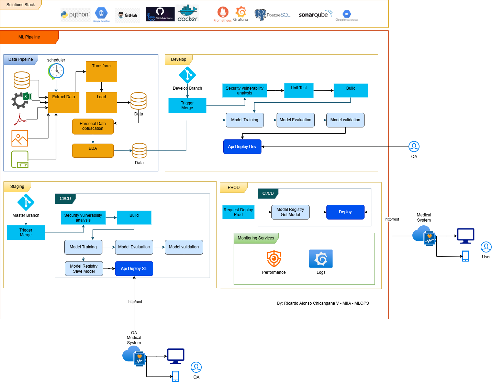

## 📄 MLOPS – MIAA: Diseño del Pipeline para Diagnóstico Médico

**Estudiante:** Ricardo Alonso Chicangana Vidal

---

## 1. Diseño del Pipeline y Restricciones

### 1.1. ⚙️ Stack de Soluciones y Tecnologías (Arquitectura Actualizada)

El *pipeline* de MLOps se construirá utilizando las siguientes herramientas clave para asegurar robustez, seguridad, y monitoreo:

| Categoría | Herramientas Clave |
| :--- | :--- |
| **Lenguaje/Código** | Python, GitHub (Versionamiento) |
| **Automatización (CI/CD)** | Jenkins |
| **Contenedores** | Docker |
| **Infraestructura** | Google Cloud (GCP) |
| **Datos** | PostgreSQL (Base de Datos) |
| **Monitoreo/Observabilidad** | Prometheus, Grafana |
| **Seguridad de Código** | SonarQube |

### 1.2. 🛑 Restricciones y Limitaciones

* **Ética y Privacidad de Datos:** La manipulación de datos de pacientes está sujeta a normativas estrictas (como HIPAA o GDPR en Europa). Esto requiere un manejo riguroso de la anonimización, ofuscación y almacenamiento seguro.
* **Desbalance de Clases:** Es el principal desafío técnico. Las **enfermedades huérfanas** (clase minoritaria) tendrán una representación muy baja.
* **Interpretación y Explicabilidad (XAI):** En medicina, la explicabilidad del modelo es crucial. Los médicos necesitan entender por qué el modelo hizo una predicción.

### 1.3. 📊 Tipos de Datos

Los datos típicos incluirían:

* **Estructurados:** Síntomas codificados (p. ej., fiebre, dolor de cabeza), Datos demográficos (edad, sexo), y Resultados de pruebas de laboratorio.
* **No Estructurados:** Notas médicas y narrativas de la historia clínica (que requerirían Procesamiento del Lenguaje Natural - NLP) o Imágenes (radiografías, resonancias magnéticas, etc.).

---

## 2. Desarrollo del Modelo (Basado en la Etapa "Develop")

### 2.1. 💧 Fuentes de Datos y Manejo

* **Disparador:** Se ejecutará periódicamente mediante *Schedule* o por solicitud del monitoreo.
* **Extracción y Carga (Extract Data/Load):** Los datos provendrán de Bases de Datos (registros clínicos electrónicos - EHRs) y archivos (PDFs, documentos, imágenes).
* **Ofuscación y Anonimización:** Antes de la Exploratory Data Analysis (EDA), los datos personales sensibles deben ser ofuscados o pseudonimizados ("Personal Data Obfuscation").
* **EDA (Exploratory Data Analysis):** Se debe centrar en identificar el grado de desbalance de clases.

### 2.2. 🧠 Modelos de ML y Validación

#### Estrategia de Modelado

1.  **Algoritmos de Clasificación:** Modelos de Ensamble (**Random Forests + Gradient Boosting**) o **Redes Neuronales** son opciones robustas.
2.  **Técnicas para Clases Desequilibradas:**
    * Sobre-muestreo de la clase minoritaria (p. ej., usando SMOTE).
    * Sub-muestreo de la clase mayoritaria.
    * Uso de **costos de error asimétricos**, donde la penalización por un falso negativo es mucho mayor.
3.  **Transfer Learning/Meta-Learning:** Entrenar un modelo base con datos abundantes de enfermedades relacionadas y luego ajustarlo (*fine-tuning*) puede mejorar el rendimiento.

#### Validación/Testing

* **Métricas Focales:** La Precisión (*Accuracy*) es engañosa. Las métricas clave serán:
    * **Recall (Sensibilidad):** Importante para minimizar **falsos negativos** (no diagnosticar una enfermedad).
    * **F1-Score:** Balance entre Precisión y Recall.
    * Área bajo la curva **ROC (AUC)** y Área bajo la curva **PR (AUPRC)**.
* **Etapas de Validación:** La **"Model Validation"** final debe cumplir con umbrales clínicos predefinidos, no solo métricas estadísticas.
* **Seguridad y Pruebas:** En la fase CI/CD, se realizan análisis para asegurar que no haya vulnerabilidades en el código o las dependencias.

---

## 3. Producción y Monitoreo (Basado en la Etapas "Staging" y "PROD")

### 3.1. 🚀 Despliegue

1.  **Stage/Pre-Producción (Staging):**
    * El modelo se guarda en un "**Model Registry**" (*Model Registry Save Model*), garantizando la trazabilidad.
    * Se despliega en un ambiente de prueba (*Api Deploy ST*) para pruebas de integración y rendimiento con datos reales simulados.
    * Esta fase incluye la validación de **QA Medical System** (según el diagrama actualizado).

2.  **Producción (PROD):**
    * Una vez que el equipo médico y de DevOps aprueba el desempeño en Staging, se solicita el despliegue a producción (*"Request Deploy Prod"*).
    * El modelo se obtiene del registro (*"Model Registry Get Model"*) y se despliega como un servicio API (*Deploy*).

### 3.2. 🔍 Monitoreo de Servicios (Monitoring Services)

El monitoreo es crítico y requiere monitoreo de infraestructura y MLOps.

* **Rendimiento:**
    * Latencia de la API (la predicción debe ser rápida para el flujo clínico).
    * Integridad del Servicio (tiempo de actividad, errores de hardware).
* **Logs:**
    * Registro de Solicitudes: Logs de cada predicción realizada.
    * **Explicabilidad (XAI):** Registrar los factores que llevaron a la predicción para fines de auditoría y análisis clínico.
* **Necesidad de Re-Entrenamiento (Drift):** Es la consideración más importante a largo plazo.
    * **Concept Drift:** Los síntomas o la epidemiología de las enfermedades pueden cambiar con el tiempo.
    * **Data Drift:** La distribución de los datos de entrada puede cambiar (p. ej., la población de pacientes atendida es ahora mayor o de una región diferente).
* **Activación:** Si el monitoreo detecta que el rendimiento del modelo cae (p. ej., las métricas de Recall disminuyen) o que las distribuciones de datos divergen, se activa un proceso de **re-entrenamiento** que reinicia el pipeline desde la etapa de "**Data Pipeline**".

